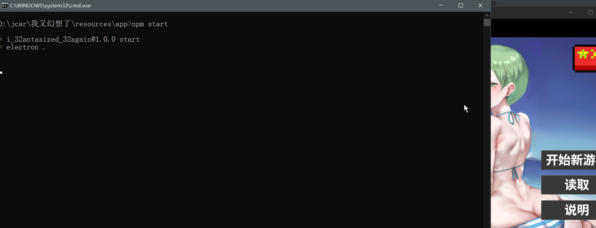

你好，electron相关的项目（比如你使用GDevelop开发的游戏），直接打包成asar文件发布，存在完全泄露的风险

**请注意**：我不仅可以运行你的asar文件，还能将其打包为exe发布，完全盗取你的劳动成果，只需要5行指令

因此：**发布asar前一定要进行加密**


我将演示如何直接运行你的asar文件

# electron运行asar


进入asar所在目录，解包asar

```
asar extract app.asar ./app
```


进入package.json所在目录

```
cd ./app
```

观察package.json所规定的electron版本

| `@electron/remote` 主要版本 | 兼容的 Electron 版本 |
| --------------------------- | -------------------- |
| **2.x**                     | **≥ 14.0.0**         |
| **1.x**                     | < 14.0.0             |

大部分时候只需要下载**最新稳定版**

```
npm install --save-dev electron@latest
```

确保需要安装的软件都安装了

```
npm install
```


#### 启动脚本

在package.json添加

```
"scripts": {
  "start": "electron ."
}
```

运行脚本

```
npm start
```

完成了游戏的启动



可以写成bat放在package.json同目录下

```
npm start
pause
```

